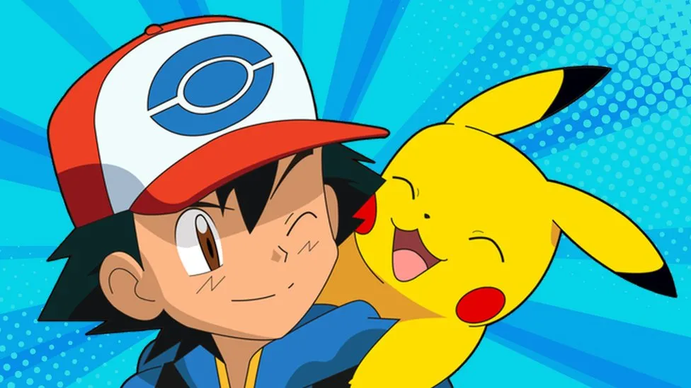
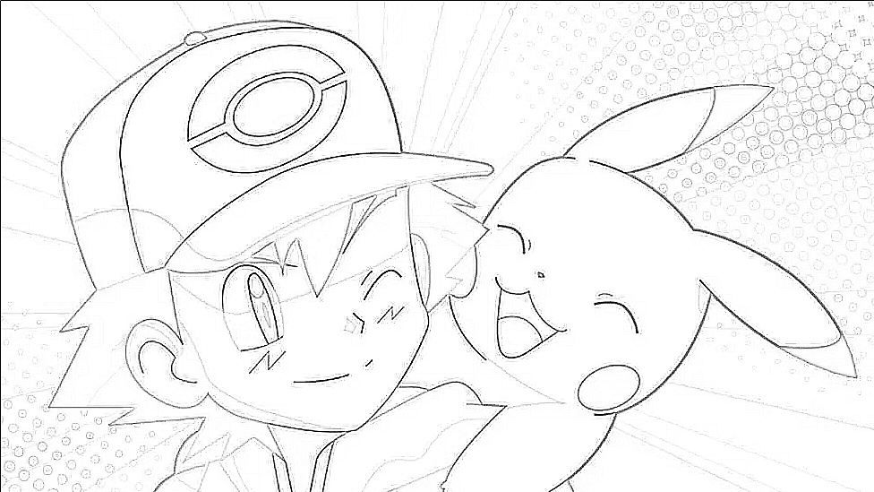

# Image Outline/Pencil Sketch Converter

This project converts an image into an outline or pencil sketch using a Laplacian filter. The implementation leverages OpenCV and NumPy libraries.

# Demo
Original image             |  Outline image
:-------------------------:|:-------------------------:
               | 

## Features

- Converts any image into an outline suitable for drawing.
- Utilizes Laplacian filter for edge detection.
- Simple command-line interface for easy usage.

## Technologies Used

- **OpenCV**: For image processing tasks.
- **NumPy**: For numerical operations and handling arrays.

## Installation

1. Clone the repository:

    ```bash
    git clone [https://github.com/ay/image-outline-converter.git](https://github.com/ayush1184/Image-Outliner.git)
    ```

2. Navigate to the project directory:

    ```bash
    cd image-outline-converter
    ```

3. Install the required dependencies:

    ```bash
    pip install opencv-python numpy
    ```

## Usage

1. Run the `main.py` script:

    ```bash
    python main.py
    ```

2. Enter the name of the image file when prompted:

    ```bash
    Enter image name:
    ```

3. The program will read the input image, process it, and save the outline as `outline.jpg` in the same directory.

## Project Structure

- **main.py**: The main script to run the image outline conversion.
- **filtering.py**: Contains the `Filtering` class which handles the image processing logic.

## Example

To convert an image named `sample.jpg`, follow these steps:

1. Place `sample.jpg` in the project directory.
2. Run the script:

    ```bash
    python main.py
    ```

3. When prompted, enter `sample.jpg`:

    ```bash
    Enter image name: sample.jpg
    ```

4. The outline image will be saved as `outline.jpg`.

## Code Explanation

### main.py

```python
import filtering
import cv2

if __name__ == "__main__":
    print('Enter image name:')
    image_name = input()
    input_image = cv2.imread(image_name, 0)
    outline = filtering.Filtering(input_image)
    an_outline = outline.get_outline()
    output_image_name = "outline.jpg"
    cv2.imwrite(output_image_name, an_outline)
